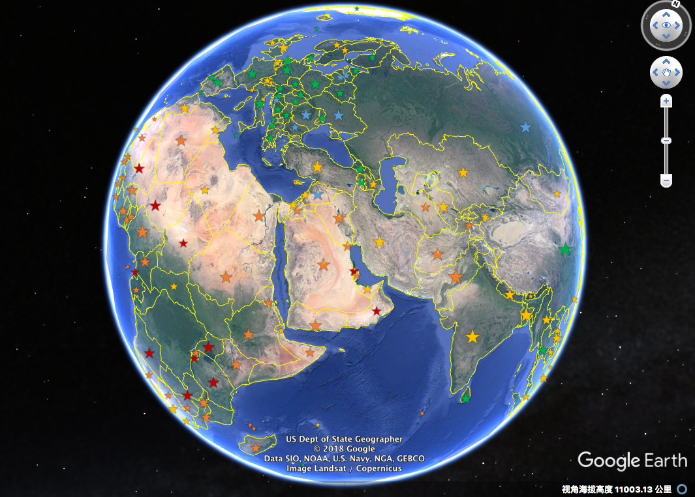
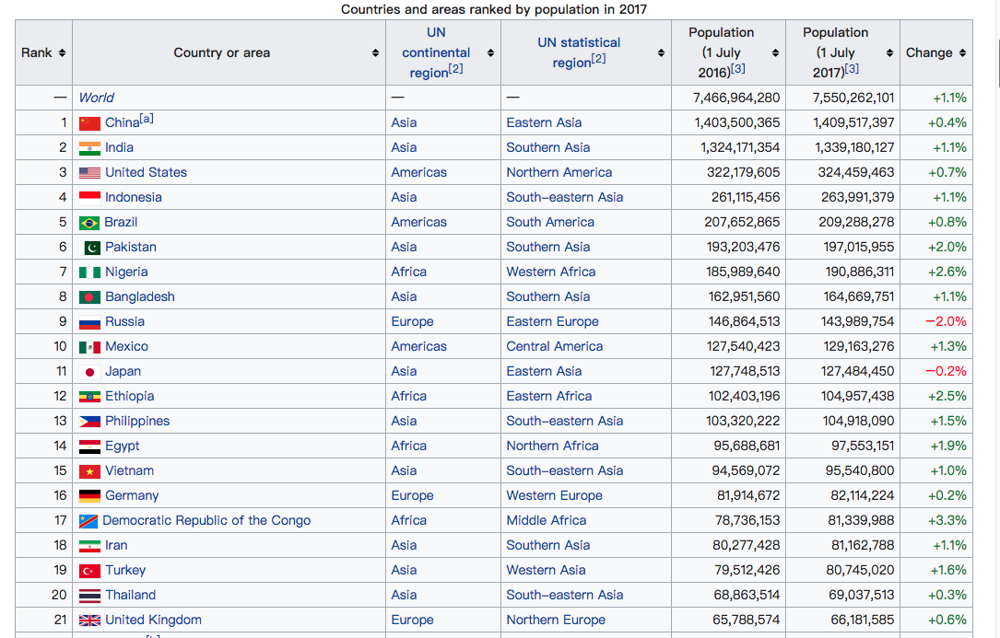

## Title
Worldwide Population Visualization on Google Earth (2016-2017)

## Purpose
This project aims to:  
(1) Use R to get and deal with the worldwide population data from   https://en.m.wikipedia.org/wiki/List_of_countries_by_population_(United_Nations)  
(2) Create kml file and visualize the data on Google Earth.  
In the final visualization result, each country's population information is represented by a **star**.  
**The color of the star** shows the size the population, and the population size increases in the order of "blue", "green", "yellow", "orange", "red". 
**The size of the star** shows the population growth rate from 2016 - 2017.  

## How to Run the Program
You can either: 
(1) Open the Part3.kml in Google Earth directly to see the final result. 
or 
(2) Run the R file to get your own kml file and also a html file containing the population information table of the  
above website.  

## Images Preview

